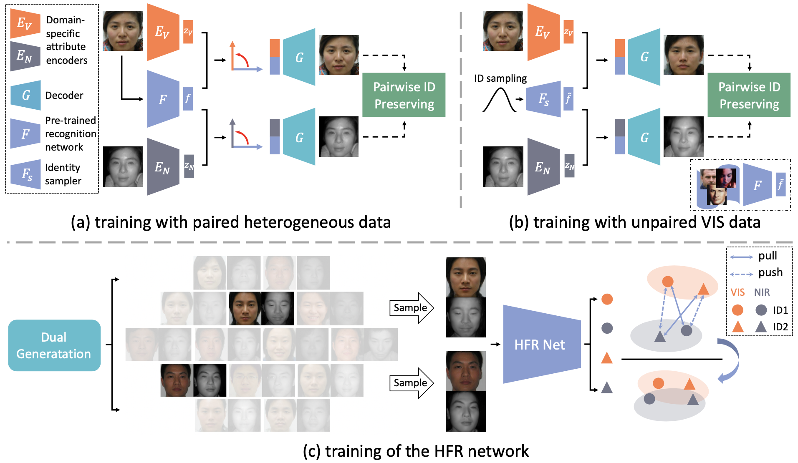

# DVG-Face: Dual Variational Generation for HFR
This repo is a [PyTorch](https://pytorch.org/) implementation of [DVG-Face: Dual Variational Generation for Heterogeneous Face Recognition](https://arxiv.org/pdf/2009.09399.pdf), which is an extension version of our previous [conference paper](https://github.com/BradyFU/DVG).


<p align="center">  
  
</p> 


## Prerequisites
- Python 3.7.0
- Pytorch 1.5.0 & torchvision 0.6.0

## Train the generator
- Download LightCNN-29 ([Google Drive](https://drive.google.com/file/d/1Jn6aXtQ84WY-7J3Tpr2_j6sX0ch9yucS/view)) pretrained on MS-Celeb-1M.
- Download Identity Sampler ([Google Drive](https://drive.google.com/file/d/1Jn6aXtQ84WY-7J3Tpr2_j6sX0ch9yucS/view)) pretrained on MS-Celeb-1M.
- Put the above two models in `./pre_train`

`train_generator.py`:
Fill out options of '--img_root' and '--train_list', which are the image root and training list of the heterogeneous data, respectively.
An example of the training list:
```
NIR/s2_NIR_10039_001.jpg 232
VIS/s1_VIS_00134_010.jpg 133
NIR/s1_NIR_00118_011.jpg 117
```
* Here we use 'NIR' and 'VIS' in the training list to distinguish the modality of images. If your list has other distinguishing marks,
please change the corresponding marks in `./data/dataset.py` (lines 28, 38, 66, and 68).


